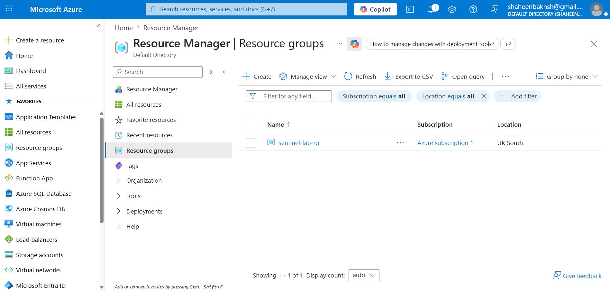
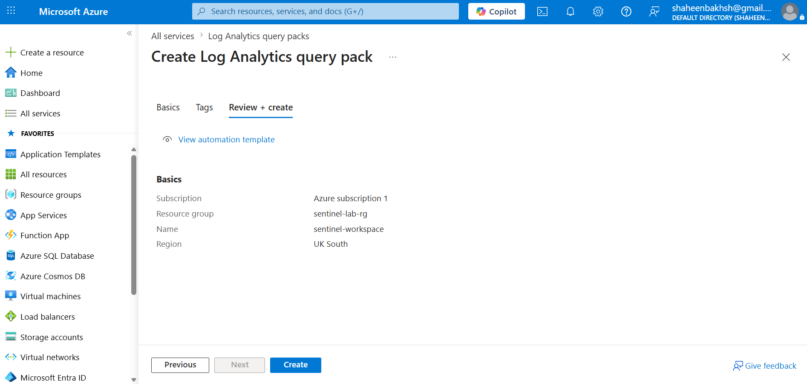
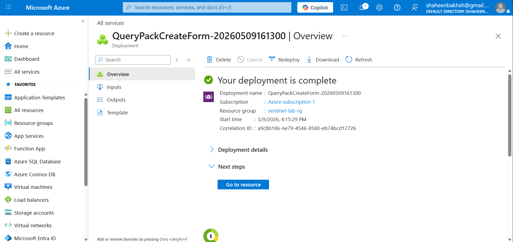
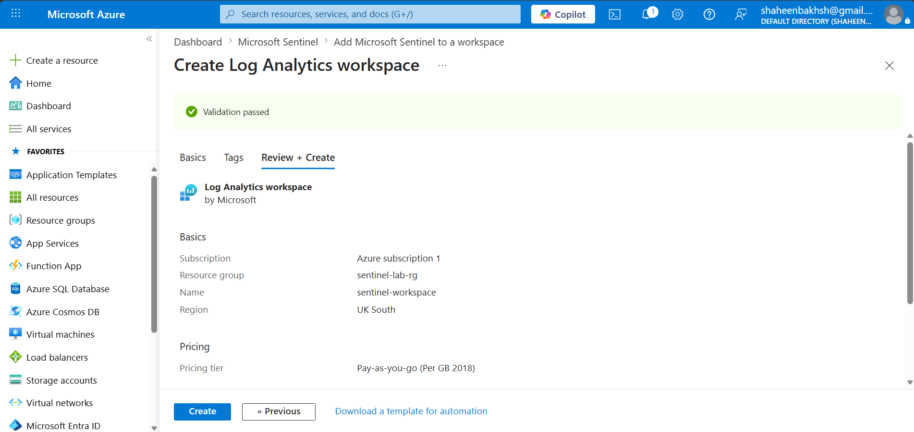
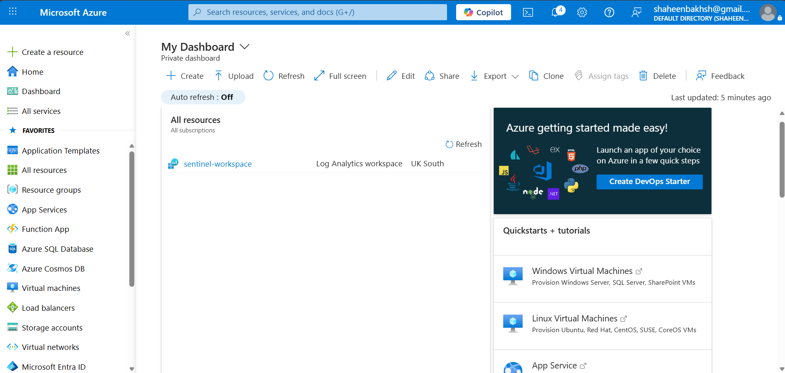
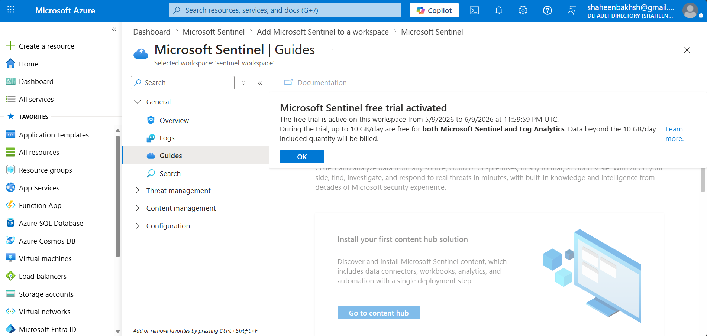
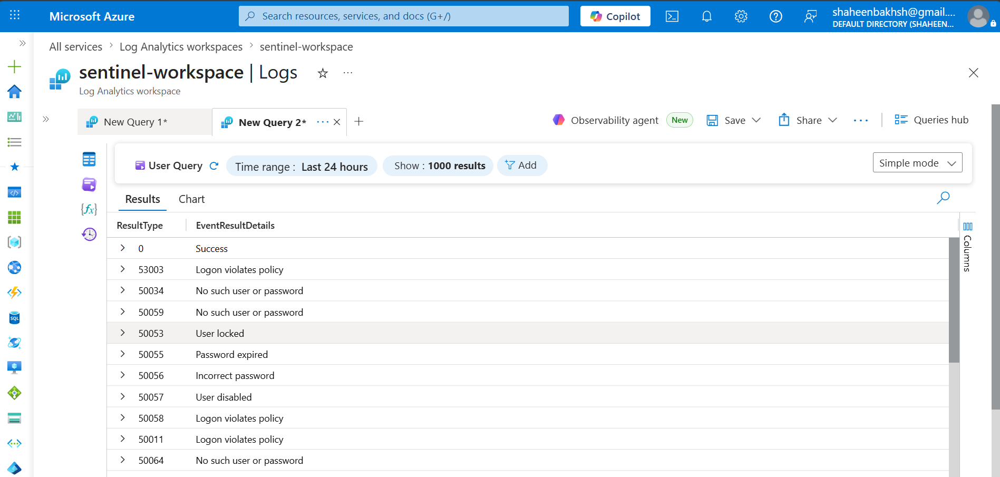
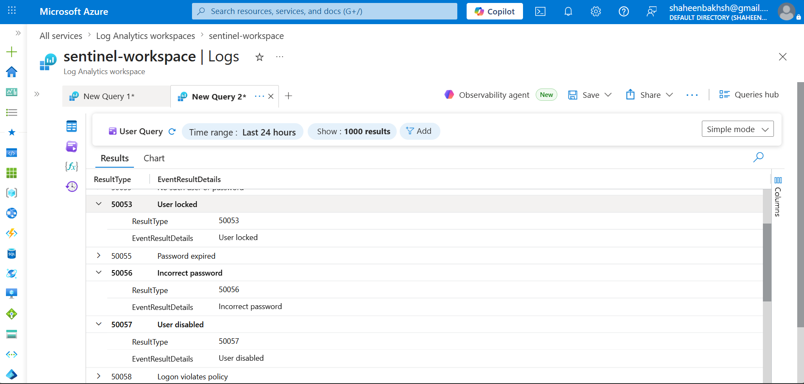

# Microsoft Sentinel SIEM Lab - Azure Cloud Detection Environment

 
 
 
 
 


---

## 📌 Project Overview
- This project documents the deployment and initial configuration of Microsoft Sentinel - Microsoft's cloud-native SIEM and SOAR platform - on Azure. The lab establishes a production-style security monitoring environment using Azure resource groups, Log Analytics workspaces, and the Microsoft Sentinel free trial.  

- The project covers end-to-end environment setup from resource group creation through Sentinel activation, workspace configuration, and initial log investigation using the ASIM normalisation schema - the standardised log format used across Microsoft's security stack.  

- Azure AD authentication error codes were explored and analysed using the Log Analytics interface, identifying security-relevant events including account lockouts, incorrect password attempts, disabled account access attempts, and conditional access policy violations - the same categories of events investigated daily in enterprise SOC environments using Sentinel.  

---

## 🎯 Objectives
- Deploy a dedicated Azure resource group and Log Analytics workspace for security monitoring  
- Activate Microsoft Sentinel and configure it against the Log Analytics workspace  
- Explore the ASIM (Advanced Security Information Model) normalisation schema used across Microsoft's security products  
- Investigate Azure AD authentication error codes using the Log Analytics interface  
- Identify and classify security-relevant authentication error codes aligned to SOC investigation workflows  
- Document the full deployment and investigation process aligned to real-world cloud SIEM setup procedures  

---

## 🖥️ Environment

| **Component**       | **Detail** |
|----------------------|------------|
| Cloud Platform       | Microsoft Azure |
| SIEM                 | Microsoft Sentinel (Free Trial - 10GB/day) |
| Workspace            | sentinel-workspace (Log Analytics) |
| Resource Group       | sentinel-lab-rg |
| Region               | UK South |
| Query Language       | KQL (Kusto Query Language) |
| Log Schema           | ASIM - Advanced Security Information Model |
| Subscription         | Azure Subscription 1 |

---

## 🔍 Azure AD Authentication Error Codes Analysed

| **Error Code** | **Description** | **SOC Relevance** |
|----------------|-----------------|-------------------|
| 0              | Success | Baseline successful authentication |
| 50053          | User locked | Account lockout - potential brute-force indicator |
| 50056          | Incorrect password | Failed authentication - credential attack indicator |
| 50057          | User disabled | Disabled account access attempt - suspicious activity |
| 50055          | Password expired | Expired credential logon attempt |
| 50034          | No such user or password | Non-existent account targeted - enumeration indicator |
| 50059          | No such user or password | Non-existent account targeted - enumeration indicator |
| 50064          | No such user or password | Non-existent account targeted |
| 53003          | Logon violates policy | Conditional access policy block |
| 50058          | Logon violates policy | Session policy violation |
| 50011          | Logon violates policy | Reply address mismatch policy block |
| 50072          | Logon violates policy | MFA required but not completed |
| 50074          | Logon violates policy | Strong authentication required |
| 50020          | Logon violates policy | Unauthorised access attempt |
| 50005          | Logon violates policy | Platform conditional access block |

---

## 🗂️ MITRE ATT&CK Relevance

| **Technique ID** | **Technique Name** | **Relevance** |
|------------------|--------------------|---------------|
| T1110            | Brute Force | Error codes 50053 (lockout) and 50056 (incorrect password) indicate repeated failed authentication |
| T1078            | Valid Accounts | Success code (0) following failures indicates potential credential compromise |
| T1087            | Account Discovery | Error codes 50034, 50059, 50064 (no such user) indicate account enumeration attempts |
| T1556            | Modify Authentication Process | Conditional access policy violations (53003, 50058) indicate policy bypass attempts |

---

## 📋 KQL Reference - Authentication Error Analysis

During this lab the `_ASIM_AADSTSErrorCodes` table was explored using the Log Analytics simple mode interface. The following KQL queries represent the logical next steps for detection engineering against this data - queries that would be built in a production Sentinel environment using this error code schema:

- **Detect account lockout patterns (T1110):**
```kql
_ASIM_AADSTSErrorCodes
| where ResultType == 50053
```
- **Identify credential failure categories:**
```kql
_ASIM_AADSTSErrorCodes
| where EventResultDetails in ("User locked", "Incorrect password", "No such user or password")
```
- **Surface policy violation codes:**
```kql
_ASIM_AADSTSErrorCodes
| where EventResultDetails == "Logon violates policy"
```
****Note: These queries were developed as reference detection logic based on the ASIM schema explored during this lab. A production implementation would run these against live SigninLogs data ingested via an Entra ID data connector.****

---
## 📸 Screenshots & Observations

### 1️⃣ Resource Group Created
  
**Observation:** Azure resource group `sentinel-lab-rg` successfully created in UK South region under Azure Subscription 1. Resource groups are the foundational container for all Azure security resources - establishing the correct resource boundary before deploying any security services.

---

### 2️⃣ Log Analytics Workspace Configuration
  
**Observation:** Log Analytics workspace `sentinel-workspace` configured and ready for creation. Workspace name, resource group `sentinel-lab-rg`, and region UK South confirmed before deployment. Log Analytics is the data store underpinning Microsoft Sentinel - all ingested logs, KQL queries, and detection rules operate against this workspace.

---

### 3️⃣ Workspace Deployment Complete
  
**Observation:** Deployment confirmed complete with green success indicator. Deployment name `QueryPackCreateForm-20260509161300` recorded in `sentinel-lab-rg` resource group with start time 5/9/2026 4:15:29 PM. Successful deployment confirms the workspace infrastructure is live and ready for Sentinel activation.

---

### 4️⃣ Sentinel Workspace Validation Passed
  
**Observation:** Log Analytics workspace validation passed - confirming configuration is correct before creation. Pay-as-you-go pricing tier selected, region UK South confirmed. Validation passing is a prerequisite for Sentinel deployment - ensures no configuration conflicts before the SIEM environment goes live.

---

### 5️⃣ Sentinel Workspace Live on Dashboard
  
**Observation:** Azure dashboard confirms `sentinel-workspace` is live as a Log Analytics workspace in UK South. The resource is active and accessible - confirming end-to-end successful deployment of the foundational cloud monitoring infrastructure.

---

### 6️⃣ Microsoft Sentinel Free Trial Activated
  
**Observation:** Microsoft Sentinel free trial confirmed active on `sentinel-workspace` from 5/9/2026 to 6/9/2026 at 11:59:59 PM UTC. Up to 10GB/day free for both Microsoft Sentinel and Log Analytics. Sentinel is now live and operational - the cloud-native SIEM is ready for data ingestion, KQL investigation, and detection rule configuration.

---

### 7️⃣ ASIM AAD Error Codes Table Preview
  
**Observation:** Preview of the `_ASIM_AADSTSErrorCodes` built-in reference table in Log Analytics - showing 28 records of Azure AD STS authentication error codes using the ASIM normalisation schema. `ResultType` and `EventResultDetails` columns visible. Security-relevant codes include 50053 User locked, 50056 Incorrect password, 50057 User disabled, 50034/50059/50064 No such user or password, and multiple policy violation codes (53003, 50058, 50011) - the same authentication failure categories targeted by SOC detection rules in production Sentinel environments.

---

### 8️⃣ ASIM Error Codes - Expanded Row Detail
  
**Observation:** Expanded view of three individual error code records - 50053 User locked, 50056 Incorrect password, and 50057 User disabled - showing the full ASIM schema field structure with `ResultType` and `EventResultDetails` per record. These three codes are among the highest-priority indicators in Azure AD authentication monitoring - 50053 indicates potential brute-force account lockout mapped to MITRE ATT&CK T1110, while 50057 indicates an attempt to authenticate with a disabled account requiring immediate SOC investigation.

---

## 🛠️ Key Skills Demonstrated
- Microsoft Azure resource group and Log Analytics workspace deployment  
- Microsoft Sentinel activation and free trial configuration  
- ASIM (Advanced Security Information Model) schema exploration  
- Azure AD authentication error code analysis and SOC classification  
- Cloud SIEM environment setup and navigation  
- Security-relevant log identification and MITRE ATT&CK mapping  
- KQL reference query development for detection engineering  

---

## 📝 Lab Notes
This lab was built on the Microsoft Azure free tier. The `_ASIM_AADSTSErrorCodes` table provides the standardised Azure AD authentication error code reference used across Microsoft's security stack including Microsoft Sentinel, Microsoft Defender, and Entra ID. In a production environment this table is used alongside `SigninLogs` and `AuditLogs` data connectors to build detection rules targeting real authentication failures at scale.  

**Next steps for this lab:**
- Connect a data source via Log Analytics agent or Diagnostics settings  
- Ingest real SigninLogs from Azure AD  
- Build Analytics Rules targeting T1110 and T1078 techniques  
- Configure incident creation and investigation workflows  

---

## 🔒 Environment Notice
This lab was built on a personal Azure free trial subscription for portfolio purposes. No production data or sensitive information was used. All configurations follow Microsoft's recommended security practices for lab environments.  

---

## 👤 Author
- **Shaheen Bakhsh - Cybersecurity Analyst**
